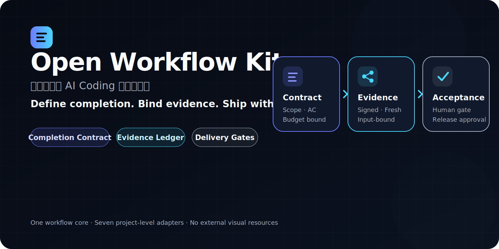
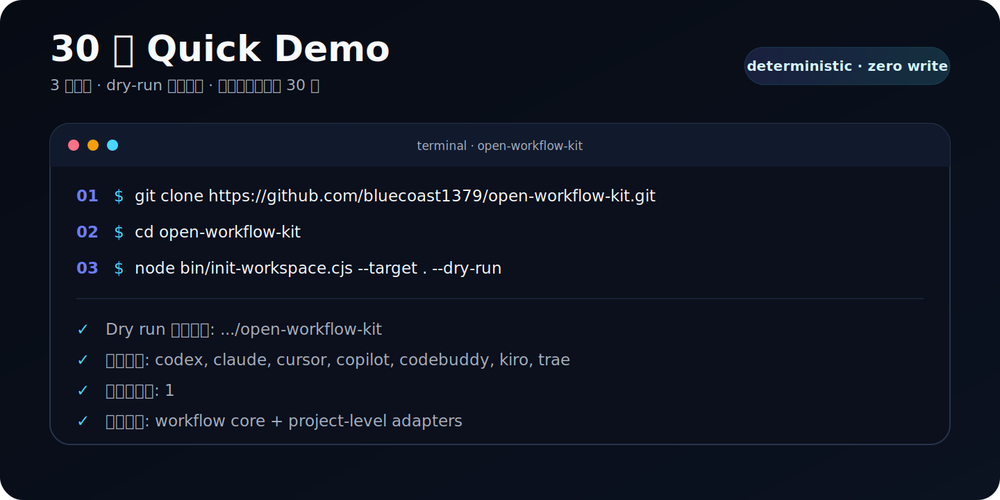
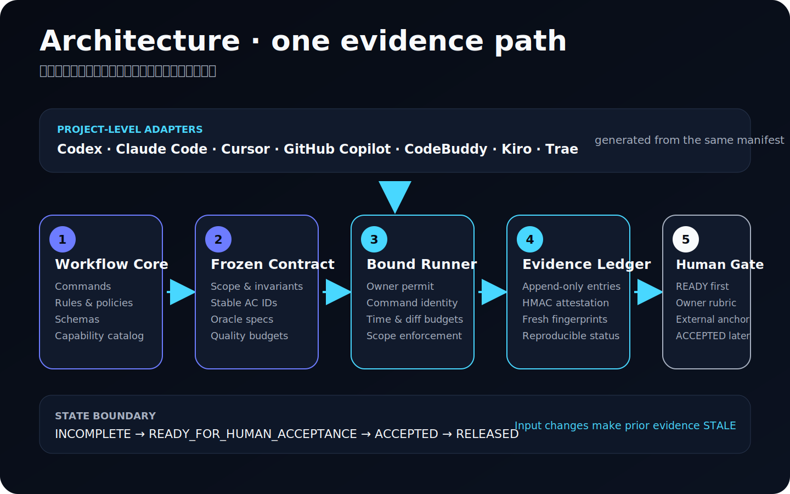

# Open Workflow Kit



[](https://github.com/bluecoast1379/open-workflow-kit/actions/workflows/check.yml)
[](./LICENSE)
[](./package.json)

**面向团队级 AI Coding 的交付治理。** Open Workflow Kit 把“什么叫完成”编译成可检查、可执行、可复验、会在输入变化时失效的研发契约。Completion Contract 冻结标准，Evidence Ledger 保存证据，有预算的 `run-until-done` 只在授权范围内收敛；自动完成、人工验收与发布始终是不同状态。

## 如何选择三套开源项目

| 项目 | 最适合谁 | 解决什么问题 |
| --- | --- | --- |
| **[open-workflow-kit](https://github.com/bluecoast1379/open-workflow-kit)**（本项目） | 使用多个 AI Coding 工具的研发团队 | 用完成合同、证据账本和交付闸门治理“定义完成 → 自动验证 → 人工验收” |
| [business-agent](https://github.com/bluecoast1379/business-agent) | 构建业务 Agent 的产品与工程团队 | 提供业务 Agent 的规划、网关、评测与运行骨架 |
| [openone-workflow-kit](https://github.com/bluecoast1379/openone-workflow-kit) | 独立开发者与小型产品团队 | 用研发轨 + 商业化轨把个人产品从想法推进到发布和复盘 |

## 30 秒 Quick Demo

> 下面是 3 个动作；下载时间不计入 30 秒。`--dry-run` 只输出计划，不写入文件。

```bash
git clone https://github.com/bluecoast1379/open-workflow-kit.git
cd open-workflow-kit
node bin/init-workspace.cjs --target . --dry-run
```

预期看到 `Dry run 目标目录`、`启用工具`、`已识别仓库` 和 `计划写入`，说明同一套 workflow core 已为各工具解析出确定性安装计划。需要安装到真实工作区时，请改用目标目录并先阅读[快速开始](#快速开始)。



## 架构一览



关键事实不依赖图片：`workflow/core/` 是工具无关的单一事实源；初始化器生成各平台 adapter；Completion Contract 与 Owner-signed permit 限定执行范围；Oracle 结果写入 Evidence Ledger；只有当前证据满足自动 AC 时才进入 `READY_FOR_HUMAN_ACCEPTANCE`，人工签收后才可能成为 `ACCEPTED`。

## 1.0 的核心能力

| 能力 | 作用 |
| --- | --- |
| Completion Contract | 用稳定 `AC-###` 定义业务结果、范围、不变量、领域数据流、质量预算、人工闸门、自动 Oracle 和自主预算 |
| Definition Lint | 阻断重复 ID、模糊验收、缺失 Oracle、空质量预算、越界命令和未闭环的 blocking unknown |
| Evidence Ledger | 以 append-only JSONL、HMAC entry 与外部 head/count anchor 保存 `PASS/FAIL/BLOCKED/NOT_RUN/STALE/WAIVED`；证据绑定 contract、source、environment、executor 与 artifact |
| 可恢复收敛循环 | `run-until-done` 持久化 checkpoint，受迭代、时间、命令次数、diff、重复失败和无进展预算约束 |
| 防作弊完成判定 | contract/source/environment 任一变化都会使旧证据失效；findings snapshot 变化会使 permit/checkpoint/anchor 失配；agent 不能自行降阈值、删除 AC、扩大 waiver 或把人工闸门改为自动通过 |
| 安全 Oracle 执行 | 命令固定使用 `shell:false` 的 `command + args`，工作目录不能越出 workspace；Owner-signed permit 绑定完整 command spec、Oracle/executable integrity、environment/findings、scope、base 与预算 |
| 31 个检查能力、24 条 Definition 规则、6 个 policy packs | 将商业价值、组织共识、UX、人因、性能成本、韧性、安全隐私、可观测性、可逆演进和 AI 质量纳入 Definition of Done |
| 23 个统一命令 | `workflow/core/command-manifest.yaml` 是跨工具入口的单一事实源，包含 `/define-done` 与 `/deliver-until-done` |
| 7 个项目级 adapter | Codex、Claude Code、Cursor、GitHub Copilot、CodeBuddy、Kiro、Trae 都生成项目级入口；自动 conformance 不等于真实工具认证 |

本 kit 的四层结构：

- `workflow/core/`：工具无关的命令、能力、policy packs、schemas、模板、执行策略和规则目录。
- `workflow/team-profile.yaml`：可提交、可脱敏审查的团队契约；本地私有值进入被忽略的 `workflow/local/`。
- `workflow/adapters/`：七个平台的路径、发现方式、支持状态和验收口径。
- `examples/`：只含合成数据和正负黄金样例，不是运行时信任源。

## 快速开始

在目标工作区根目录运行：

```bash
node ../open-workflow-kit/bin/init-workspace.cjs \
  --target . \
  --tools codex,claude,cursor,copilot,codebuddy,kiro,trae
```

也可以使用 wrapper：

```bash
../open-workflow-kit/install.sh . --tools codex,claude,cursor
```

常用参数：

```bash
# 非交互初始化；待补资料写入 workflow/INITIALIZATION_QUESTIONS.md
node ../open-workflow-kit/bin/init-workspace.cjs --target . --tools codex,claude --yes

# 只预览，不写入
node ../open-workflow-kit/bin/init-workspace.cjs --target . --dry-run

# 升级已初始化的工作区；team-profile 永不被原地覆盖
node ../open-workflow-kit/bin/init-workspace.cjs --target . --upgrade

# trea 会归一为 trae
node ../open-workflow-kit/bin/init-workspace.cjs --target . --tools trea
```

从 tarball、Git commit 或 registry 安装见 [可分享安装方式](./docs/shareable-install.md)。文档不会假定某个远程 tag 已存在。

## 先定义完成，再授权实现

初始化 Completion Contract：

```bash
node workflow/bin/check-completion-contract.cjs \
  --init \
  --feature account-export \
  --workspace .
```

完成 `features/account-export/completion/contract.yaml` 后 lint：

```bash
node workflow/bin/check-completion-contract.cjs \
  --contract features/account-export/completion/contract.yaml
```

Contract 至少定义：

- 可证伪的业务目标、North Star、baseline、target、观测窗口和 guardrails；
- source paths、allowed/forbidden paths、non-goals、preserved invariants 及其 AC 映射；
- 实体、数据流、状态机、权威数据源和共享术语；
- 性能、可靠性、成本、可访问性、安全、隐私、可观测性、回滚、演进和 AI 质量预算；
- 每条 AC 的 Given/When/Then、blocking、human gate、Oracle、证据和优先级；至少一条 blocking manual gate 保留给有权验收者；
- 迭代、累计时间、命令、成本单位、diff、重复失败、无进展预算与停止条件。

完整说明见 [Completion Contract](./docs/completion-contract.md)，黄金样例见 [Definition-to-Done examples](./examples/definition-to-done/README.md)。

## 证据与完成判定

验证 ledger：

```bash
node workflow/bin/evidence-ledger.cjs verify \
  --ledger features/account-export/completion/evidence/ledger.jsonl \
  --attestation-key automation-local-v1=OWK_AUTOMATION_KEY \
  --attestation-key human-owner-v1=OWK_HUMAN_KEY
```

不提供 attestation key 时只验证 hash chain，输出 `attestation_valid: null`；只有 `valid: true` 才表示 chain 与所有 entry 的 HMAC 都已验证。

聚合当前 DoD：

```bash
node workflow/bin/sign-ledger-anchor.cjs \
  --contract features/account-export/completion/contract.yaml \
  --ledger features/account-export/completion/evidence/ledger.jsonl \
  --cwd . \
  --environment-manifest features/account-export/completion/environment.yaml \
  --findings features/account-export/completion/findings.yaml \
  --private-key /owner-controlled/ledger-private.pem \
  --public-key /owner-controlled/ledger-public.pem \
  --output /owner-controlled/account-export.anchor.json

node workflow/bin/evaluate-dod.cjs \
  --contract features/account-export/completion/contract.yaml \
  --ledger features/account-export/completion/evidence/ledger.jsonl \
  --cwd . \
  --environment-manifest features/account-export/completion/environment.yaml \
  --findings features/account-export/completion/findings.yaml \
  --attestation-key automation-local-v1=OWK_AUTOMATION_KEY \
  --attestation-key human-owner-v1=OWK_HUMAN_KEY \
  --ledger-anchor /owner-controlled/account-export.anchor.json \
  --ledger-anchor-public-key /owner-controlled/ledger-public.pem
```

`automation_complete` 与 `accepted` 是两个不同结论：自动 blocking AC 全部满足后，runner 只能到 `READY_FOR_HUMAN_ACCEPTANCE`，永远无权输出 `ACCEPTED`；只有独立 evaluator 在 ledger 中看到有权角色的当前人工验收证据后，才可聚合为 `ACCEPTED`。`WAIVED` 是有范围、有批准人、有理由、有到期日的例外，不会被伪装成 `PASS`。

生成本地 Done Cockpit：

```bash
node workflow/bin/generate-done-cockpit.cjs \
  --contract features/account-export/completion/contract.yaml \
  --ledger features/account-export/completion/evidence/ledger.jsonl \
  --cwd . \
  --environment-manifest features/account-export/completion/environment.yaml \
  --findings features/account-export/completion/findings.yaml \
  --attestation-key automation-local-v1=OWK_AUTOMATION_KEY \
  --attestation-key human-owner-v1=OWK_HUMAN_KEY \
  --ledger-anchor /owner-controlled/account-export.anchor.json \
  --ledger-anchor-public-key /owner-controlled/ledger-public.pem \
  --output features/account-export/completion/done-cockpit.html
```

Ledger anchor 必须在最后一条人工证据追加后由独立 Owner 签发，并保存在 Agent 工作区之外；任何新 entry、源码、环境或 findings snapshot 变化都要求重新验收并重签 anchor。

## 有预算的自主交付

只有 Contract 已冻结、实现闸门通过、执行范围被明确授权后，先用版本化 environment manifest 输出并人工复核完整运行上下文：

```bash
node workflow/bin/run-until-done.cjs \
  --contract features/account-export/completion/contract.yaml \
  --cwd . \
  --environment-manifest features/account-export/completion/environment.yaml \
  --findings features/account-export/completion/findings.yaml \
  --print-required-specs
```

Owner 在 Agent 不可写的位置保管 Ed25519 private key，把 public key fingerprint 写入冻结 Contract，并签发短期 permit：

```bash
node workflow/bin/sign-execution-permit.cjs \
  --contract features/account-export/completion/contract.yaml \
  --private-key /owner-controlled/execution-private.pem \
  --public-key /owner-controlled/execution-public.pem \
  --environment-manifest features/account-export/completion/environment.yaml \
  --findings features/account-export/completion/findings.yaml \
  --cwd . \
  --valid-minutes 60 \
  --output /owner-controlled/account-export.permit.json
```

再用 permit、public key 和独立 Evidence HMAC key 运行：

```bash
node workflow/bin/run-until-done.cjs \
  --contract features/account-export/completion/contract.yaml \
  --cwd . \
  --environment-manifest features/account-export/completion/environment.yaml \
  --findings features/account-export/completion/findings.yaml \
  --execution-permit /owner-controlled/account-export.permit.json \
  --execution-public-key /owner-controlled/execution-public.pem \
  --attestation-key-id automation-local-v1 \
  --attestation-key-env OWK_AUTOMATION_KEY
```

Permit 用 Ed25519 签名同时绑定 contract、environment/fixture/runtime、显式 findings review snapshot、base commit、scope、完整 command specs、resolved executable fingerprints 与预算；公开 hash 本身不再被当作授权。`findings.yaml` 的空数组表示“Owner 已检查且当前无 finding”，缺失、过期或 owner/source 不匹配都会阻断。Evidence HMAC key 至少 32 bytes、按 principal 分权，并在读取后从进程环境移除。循环只会到达 `READY_FOR_HUMAN_ACCEPTANCE`、`BLOCKED_WITH_DECISION_PACKET` 或 `BUDGET_EXHAUSTED`，并用 HMAC checkpoint 锚定累计时间、成本、ledger head/count 与恢复点。它不隐含人工签收、push、merge、deploy、生产写入、数据库写入或 package publish 权限。详细边界见 [自主交付与恢复](./docs/autonomous-delivery.md)。

## 23 个工作流命令

建议路径如下；阶段可按项目裁剪，但硬闸门不能被 adapter 降级：

1. `/init-workspace`、`/connect-toolchain`、`/new-feature`
2. `/01-需求讨论`、`/02-产品文档`、`/02B-UI设计`，需要时追加 `/02C-HTML原型`
3. `/03-06-研发准备`；手动路径则依次完成 `/03-技术架构` 与 `/06-测试用例`（全部 Oracle 保持 `NOT_RUN`）
4. `/define-done` 最终复核并冻结 Completion Contract、environment 与 findings 边界
5. `/deliver-until-done`；手动路径则推进 `/04-代码实现`（含适用的 04A/04B）→ `/05-代码审查` → `/07-测试执行`
6. 自动证据达到 `READY_FOR_HUMAN_ACCEPTANCE` 后进入人工验收
7. `/08-验收表格`、`/09-验收`
8. `/10-培训文档`、`/11-上线邮件通知`、`/12-复盘总结`
9. 随时使用 `/workflow-status`

涉及 UI 或前端时，`/02B-UI设计` 是 `/04A-前端代码实现` 的设计闸门。`/03-06-研发准备` 只授权分析和文档；它先产出 03/06 draft，再由 `/define-done` 冻结，不能直接跳到实现。业务代码修改还必须通过功能分支、阶段和 worktree 隔离检查。

## 七个平台的入口

| 平台 | 项目级发现入口 | 当前状态 |
| --- | --- | --- |
| Codex | `.agents/skills/`；Desktop `/` 的 Skills 分组，CLI/IDE 用 `/skills` 或 `$<skill-slug>`；不支持字面项目命令 `/01-需求讨论` | `native_not_yet_manually_certified` |
| Claude Code | `.claude/commands/` 的 `/` 模糊搜索 | `native_not_yet_manually_certified` |
| Cursor | `.cursor/commands/` 的 Agent `/` 菜单 | `native_not_yet_manually_certified` |
| GitHub Copilot | `.github/prompts/` 的 Prompt picker；部分客户端支持 slash prompt | `native_not_yet_manually_certified` |
| CodeBuddy | `.codebuddy/commands/` 的 `/` 菜单 | `native_not_yet_manually_certified` |
| Kiro | IDE manual steering `/` 菜单与 CLI `.kiro/skills/` | `native_not_yet_manually_certified` |
| Trae | `.trae/commands/` 的 `/` panel；Trae CN 也使用同一路径 | `native_not_yet_manually_certified` |

客户端必须打开初始化器 `--target` 指向的同一个项目根；父工作区中的命令不会自动变成子仓库命令。Codex 必须使用开放标准 `.agents/skills/`，因此与 Cursor/Trae 同时安装时，这些客户端可能在 Skills 分组额外显示 Codex 阶段 Skill；各自的直接 `/{id}` Command 仍是规范入口。七个平台均已有结构 conformance；尚未宣称当前版本已在真实工具中逐一人工认证。路径、官方文档和验收方法见 [工具安装示例](./docs/tool-install-recipes.md) 与 [人工验收](./docs/adapter-manual-acceptance.md)。

## 安全与隐私边界

- 初始化器只扫描和写入本地工作区，不创建分支、不 push、不部署、不写数据库、不修改生产配置。
- 生效权限取 core 硬上限、仓库外受信策略、team-profile 请求和当次授权的最严格值。
- 生产部署/配置、DDL/DML、受保护分支写入和 package publish 不能仅凭仓库配置变成自动动作。
- 共享 profile 只保存相对路径和逻辑槽位；绝对路径、私有端点、凭证映射和原始审计进入被忽略的 `workflow/local/`。
- 证据可以证明检查发生过，但不能替代业务 Owner 对目标、waiver 和最终签收的权限。

## 本地验证与打包

```bash
npm run check
npm run check:history
npm run check:commands
npm run check:rules
npm run check:adapters
npm run check:links
npm run build:release
```

`npm run check` 覆盖语法、脱敏、规则、23 命令、Definition-to-Done、七个平台 adapter、API runner 和安装/升级 smoke。`check:history` 单独扫描 Git 历史。`build:release` 只生成本地归档与 manifest，不创建远程仓库、不 push、不打 tag、不发布 package。

## 维护与发布

- 通用规则只改 `workflow/core/`；adapter 必须保持薄入口。
- 对外发布前先看 [外部分发检查清单](./docs/release-checklist.md) 和 [维护者交接](./docs/maintainer-handoff.md)。
- 远程 push、tag、release、registry publish 仍由维护者明确授权并手工执行，见 [手动发布指南](./docs/manual-publish.md)。
- 贡献、安全与行为规范分别见 [CONTRIBUTING.md](./CONTRIBUTING.md)、[SECURITY.md](./SECURITY.md) 和 [CODE_OF_CONDUCT.md](./CODE_OF_CONDUCT.md)。
- 版本变化与迁移边界见 [CHANGELOG.md](./CHANGELOG.md)。
